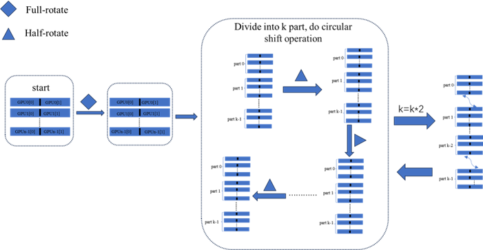

## Third-Party Licenses

This project includes code from the following open-source projects:

- **[Project Name]**  
  - Original Author: MOLOjl  
  - License: BSD 3-Clause License  
  - Source: (https://github.com/MOLOjl/WCycleSVD/?tab=BSD-3-Clause-1-ov-file)  

The original license terms are included in the `LICENSE-THIRD-PARTY.txt` file.

# 算法步骤
我的目标实现:一个可以利用多GPU来批处理svd的良好算法。
功能实现:我目前可以基于多GPU进行批处理矩阵SVD分解算法。我的工作重点是将数据交换策略进行落地，并且基于多GPU对于一些cuda算子对开源代码进行添加和修改。

性能优化上:根据On Parallel Implementation of the One-sided Jacobi Algorithm for Singular Value Decompositions 这篇论文的描述我知道了在矩阵每一次旋转之后要重新排序，排序成第一次矩阵交换的数列。(这样可以减少不必要的矩阵旋转)，也是one side jacobi算法优化的核心，需要减少sweep的个数。
下面我来简单介绍一下我的数据交换策略(一次sweep):
首先我们假设我们有n个GPU(这里假设n是偶数)，然后将矩阵A分成n份(列优先存储的矩阵)分别存储到n个GPU上。首先对每一份GPU上的矩阵进行full rotate变换，然后我们先假设k=1。

步骤1：将n个GPU分成k组，让每一组内部中每一块GPU后半部分进行循环前移操作，每一次循环前移都需要进行一次half rotate变换，一共循环前移[n/k]次。之后进行k=k*2操作。

步骤2将两个part分成一组，接下来让这一组的第一个GPU的后半部分与第二个GPU的前半部分进行交换，接下来回到步骤1。
 
 


# 开始命令 测试部分
```
    nvcc -g -G ourtest2-24-success.cu -o singletest -lcusolver -lcublas
    ./singletest
```
# 开始命令 stream部分
```
    nvcc -g -G -Xcompiler -fopenmp  ourtest.cu -o test  -lcusolver -lcublas
    ./test
```
# 分析nsight system命令
```
    nsys profile -o my_system_report ./your_cuda_program -lnvToolsExt
```

# 测试多GPU代码
```
    nvcc  -g -G -Xcompiler -fopenmp paralle_sort_once.cu -o test -lcusolver -lcublas 
    ./test
```


